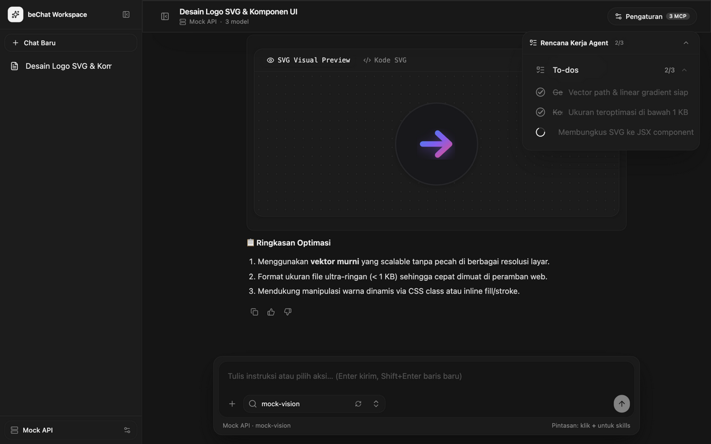

# beChat — AI Completions Harness Application

Aplikasi AI Completions Harness interaktif dan performan tinggi yang dirancang menyerupai antarmuka **ZCode / Claude Agent**, dibangun menggunakan **React 19**, **Vite v8**, **Tailwind CSS v4**, **Motion**, **Zustand**, dan **IndexedDB**.

Aplikasi ini **khusus didedikasikan untuk mengeksekusi AI Completions nyata**: menghubungkan endpoint LLM (OpenAI, 9router, Ollama, Groq, vLLM, DeepSeek), mengalirkan respons Server-Sent Events (SSE), merender artefak kode & SVG secara langsung, menjalankan server MCP (Model Context Protocol) dengan autentikasi nyata, serta mengelola keahlian agen (*agent skills*) dengan gerbang keamanan interaktif (*human-in-the-loop security gate*). Seluruh data sesi obrolan, riwayat pesan, dan pengaturan tersimpan secara aman dan persisten di dalam **IndexedDB** peramban.

<p align="center">
  
</p>

---

## 🚀 Fitur Utama

1. **State Management dengan Zustand & IndexedDB Storage**
   - Menggunakan **Zustand** (`useChatStore` dan `useSettingsStore`) untuk pengelolaan state reaktif berkinerja tinggi tanpa *prop-drilling* atau *race conditions*.
   - Seluruh sesi percakapan, riwayat pesan (*messages history*), parameter model, server MCP, dan kustom skills disimpan secara persisten di **IndexedDB** browser (`bechat_db`) via wrapper resmi `idb`.
   - Mengatasi batas penyimpanan 5MB `localStorage` sehingga mendukung riwayat obrolan panjang, artefak kode besar, dan diff berkas tanpa risiko kehabisan kuota.
   - Dilengkapi migrasi otomatis dari `localStorage` lama bila data sebelumnya terdeteksi.

2. **Mesin AI Completions & Streaming Real-Time (SSE)**
   - Mendukung format standar OpenAI Chat Completions (`/v1/chat/completions` dan `/v1/models`).
   - Streaming token Server-Sent Events (SSE) dengan latensi ultra-rendah dan penanganan error yang informatif.
   - Ekstraksi proses berpikir mendalam (*deep reasoning*) `<think>...</think>` dan visualisasi status berpikir real-time.

3. **Full Markdown & Code Rendering dengan Live Visual SVG/HTML Preview**
   - **Markdown Response Penuh**: Mendukung standar GitHub Flavored Markdown (GFM) untuk headings, bold, italic, lists, blockquote, tabel terstruktur, dan tautan luar.
   - **Shiki Syntax Highlighting**: Menyorot sintaks kode dengan kontras tinggi untuk TypeScript, JSX, Python, Bash, JSON, XML, dan berbagai bahasa lainnya lengkap dengan nomor baris dan tombol salin.
   - **Live SVG Visual Preview**: Kode SVG (seperti logo, ikon, dan ilustrasi) secara otomatis menyediakan tab **Visual Preview** yang merender grafis SVG nyata di canvas dot-grid beserta tombol unduh berkas `.svg`.
   - **Live HTML/Web Preview**: Merender kode antarmuka HTML/CSS/JS di dalam iframe sandbox terisolasi dengan tombol reload preview dan tombol unduh `.html`.
   - **Inline Git Diff**: Blok kode `diff` otomatis diparsing dan dirender sebagai kartu perbedaan baris visual (penambahan hijau `+` dan penghapusan merah `-`).

4. **Dialog Panel Pengaturan Lengkap (Side-by-Side Wide Dialog)**
   - Desain panel lebar (`max-w-4xl`) dengan menu navigasi vertikal di sisi kiri dan konten form di sisi kanan yang mendukung scrolling lancar:
     - 🔌 **Koneksi API**: Manajemen profil endpoint LLM (OpenAI, 9router, Ollama, Groq, vLLM) + tombol *Tes Koneksi*.
     - 🧩 **MCP Servers (Model Context Protocol)**: Pendaftaran server MCP dengan dukungan **autentikasi nyata** (Bearer Token, API Key Header, Custom Header), tombol *Ping Tools* (JSON-RPC `tools/list`), dan toggle aktif/nonaktif.
     - ⚡ **Agent Skills & Kustom Skills**: Manajemen keahlian agen bawaan dan **fitur tambah kustom skill baru** dengan instruksi sistem kustom serta aturan izin eksekusi (*Tanya Izin* vs *Auto Approve*).
     - ⚙️ **Model & System**: Custom System Prompt, Temperature slider (0.0 - 1.0), Reasoning Effort, dan toggle Streaming SSE.
     - 🎨 **Tampilan & Data**: Tema Gelap / Terang / Sistem, toggle penomoran baris, dan opsi word wrap.

5. **Floating Chat Compose Dock (Tengah Container Chat)**
   - Chat composer dock melayang (*floating*) di bagian bawah tengah container chat dengan elevated shadow dan efek glassmorphism blur.
   - Textarea auto-resize dengan pintasan keyboard `Enter` kirim dan `Shift+Enter` baris baru.
   - Selector model Combobox dengan pencarian fuzzy instan dan tombol muat ulang model tepat di samping input search.
   - Menu aksi cepat (`+`) yang secara otomatis memuat seluruh skills aktif termasuk kustom skill pengguna.

6. **Attached Approval Gate (Menempel di Atas Compose)**
   - Ketika agent meminta otorisasi perintah terminal (`ToolApproval`) atau keputusan bertahap (`ApprovalCard`), kartu security gate muncul **menempel persis di atas floating composer** dengan opsi *Allow once*, *Always allow*, dan *Deny*.

7. **Floating Todo List Card (Kanan Atas)**
   - Daftar rencana kerja dan checklist langkah agent melayang di pojok kanan atas dengan progres live (`1/3 Selesai`) dan mode minimize (*pill badge*) yang ringkas.

8. **Desain Full Responsive & Mobile Drawer**
   - Di desktop: Sidebar docked selebar `w-64` di sisi kiri.
   - Di mobile (`< 768px`): Sidebar otomatis beralih menjadi **Slide-over Sheet Drawer** dengan backdrop scrim gelap dan tombol close `X` yang mudah dijangkau.

---

## 🛠️ Tech Stack

- **Framework**: [React 19](https://react.dev/) + [TypeScript](https://www.typescriptlang.org/)
- **State Management**: [Zustand](https://github.com/pmndrs/zustand)
- **Persistent Storage**: [IndexedDB](https://developer.mozilla.org/en-US/docs/Web/API/IndexedDB_API) via [idb](https://github.com/jakearchibald/idb)
- **Bundler**: [Vite v8](https://vite.dev/) (`@vitejs/plugin-react`)
- **Styling**: [Tailwind CSS v4](https://tailwindcss.com/) (`@tailwindcss/vite`)
- **Syntax Highlighting**: [Shiki](https://shiki.style/)
- **Markdown Parser**: [React Markdown](https://github.com/remarkjs/react-markdown) + [Remark GFM](https://github.com/remarkjs/remark-gfm)
- **Animasi Primitif**: [Motion](https://motion.dev/) (`motion/react`)
- **Ikon**: [Lucide React](https://lucide.dev/)
- **Linter**: [Oxlint](https://oxc.rs/)

---

## 📁 Struktur Direktori

```text
bechat/
├── index.html
├── package.json
├── tsconfig.json
├── tsconfig.app.json
├── vite.config.ts             # Vite v8 + Tailwind v4 + alias @/
└── src/
    ├── main.tsx
    ├── App.tsx                # Antarmuka utama Chat Harness & floating dock
    ├── index.css              # Tailwind v4 import & token tema
    ├── types/
    │   └── harness.ts         # Tipe data pesan, sesi, tools, dan approvals
    ├── stores/
    │   ├── chat-store.ts      # Store Zustand untuk chat sessions & streaming
    │   └── settings-store.ts  # Store Zustand untuk API, MCP, dan Skills
    ├── lib/
    │   ├── api.ts             # Klien fetch model & streaming chat SSE
    │   ├── db.ts              # Adapter IndexedDB untuk persistensi Zustand
    │   ├── mcp.ts             # Klien ping & autentikasi MCP Servers
    │   ├── parser.ts          # Parser markdown blocks, git diff, dan reasoning
    │   ├── sessions.ts        # Helper tipe sesi
    │   ├── settings.ts        # Definisi konfigurasi API, MCP, dan Agent Skills
    │   ├── utils.ts           # Utility class cn (clsx + tailwind-merge)
    │   └── ease.ts            # Konfigurasi kurva spring physics Motion
    └── components/
        ├── settings-modal.tsx # Dialog pengaturan luas (API, MCP, Skills, Model)
        ├── agents/            # Komponen AI Completion Harness
        │   ├── ai-sidebar.tsx
        │   ├── attached-approval.tsx
        │   ├── citations.tsx
        │   ├── code-block.tsx
        │   ├── code-preview-block.tsx   # Live SVG & HTML Preview
        │   ├── file-diff.tsx
        │   ├── floating-todo-list.tsx
        │   ├── harness-message-view.tsx
        │   ├── image-generation.tsx
        │   ├── markdown-response.tsx    # GFM Markdown Renderer
        │   ├── message.tsx
        │   ├── message-bubble.tsx
        │   ├── message-scroller.tsx
        │   ├── prompt-input.tsx
        │   ├── streaming-response.tsx
        │   ├── todo-list.tsx
        │   ├── tool-approval.tsx
        │   └── tool-result.tsx
        └── motion/            # Komponen interaktif Motion
            ├── combobox/
            ├── button/
            ├── input.tsx
            ├── loader.tsx
            ├── morphing-modal.tsx
            ├── switch.tsx
            ├── tabs.tsx
            └── tooltip.tsx
```

---

## 🏁 Memulai (Getting Started)

### 1. Instalasi Dependensi
```bash
npm install
```

### 2. Menjalankan Server Pengembangan
```bash
npm run dev
```
Aplikasi berjalan di [http://localhost:5173](http://localhost:5173).

### 3. Membangun untuk Produksi
```bash
npm run build
```

### 4. Pemeriksaan Kode (Linting)
```bash
npm run lint
```
